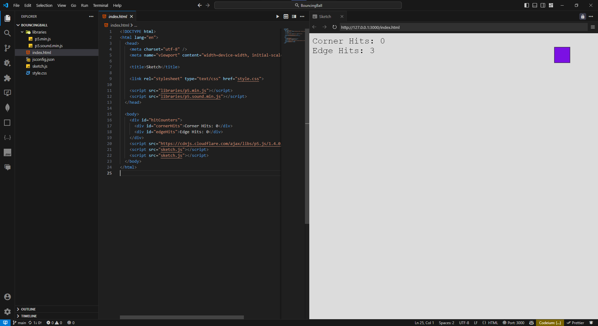

# Bouncing Ball Project

This project is a simple bouncing ball animation created using [p5.js](https://p5js.org/) and initialized using the `p5.vscode` extension. The ball bounces around the canvas, counting the number of times it hits the edges and corners. It also keeps a tally of normal hits and corner hits separately.



## Features

- Ball bounces off the edges of the canvas.
- Tracks the number of edge hits.
- Tracks the number of corner hits (when ball hits two edges simultaneously).
- Displays the hit counts on the canvas.

## Getting Started

To get started with this project, follow these steps:

1. Make sure you have [Visual Studio Code](https://code.visualstudio.com/) and the [p5.vscode extension](https://marketplace.visualstudio.com/items?itemName=samplavigne.p5-vscode) installed.
2. Clone this repository or download the code.
3. Open the folder in Visual Studio Code.
4. Modify the `sketch.js` file for logic changes and `index.html` for any HTML changes.

### Code Files

- `index.html`: Defines the structure of the web page and includes the bundled JavaScript code.
- `sketch.js`: Contains the logic for the bouncing ball, edge detection, and corner hit logic.

### Running the Project Locally

1. Open the project in VSCode.
2. Use the p5.vscode extension to start the local server.
3. The animation should start running, and you'll see the hit count for edges and corners displayed on the canvas.

## Screenshot


## Webpack Setup

To bundle this project using Webpack so that only `index.html` and `bundle.js` are needed for the final version, follow these steps:

### 1. Install Webpack

In your project directory, run:

```bash
npm init -y
```
```bash
npm install --save-dev webpack webpack-cli
```
### 2. Setup Webpack Configuration

Create a webpack.config.js file in the root directory:

```javascript
const path = require('path');

module.exports = {
  entry: './sketch.js',
  output: {
    filename: 'bundle.js',
    path: path.resolve(__dirname, 'dist'),
  },
  mode: 'development',
  module: {
    rules: [
      {
        test: /\.js$/,
        exclude: /node_modules/,
        use: {
          loader: 'babel-loader',
          options: {
            presets: ['@babel/preset-env'],
          },
        },
      },
    ],
  },
  devServer: {
    contentBase: path.join(__dirname, 'dist'),
    compress: true,
    port: 9000,
  },
};
```
### 3. Update index.html

Modify your index.html to reference the bundled file:

```html
<!DOCTYPE html>
<html lang="en">
  <head>
    <meta charset="UTF-8" />
    <meta name="viewport" content="width=device-width, initial-scale=1.0" />
    <title>Bouncing Ball</title>
  </head>
  <body>
    <script src="./bundle.js"></script>
  </body>
</html>
```
### 4. Bundle the Project

Run the following command to create the bundle.js file:

```bash
npx webpack
```
Webpack will generate a dist folder containing the index.html and bundle.js. You can now serve this folder to run the project.

### 5. Running the Webpack Dev Server

To run the project using Webpack's development server, use:
```bash
npx webpack serve
```
This will start a local development server and allow you to see your changes live.

